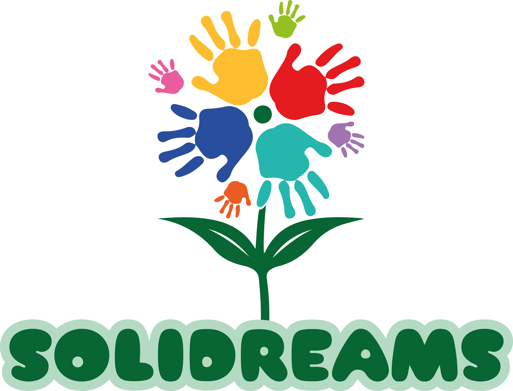

  

# Solidreams 🌟

**Solidreams** é uma plataforma inovadora desenvolvida por estudantes da **CESAR School**, com o propósito de conectar pessoas que desejam realizar seus sonhos a apoiadores dispostos a ajudar. Através de uma interface intuitiva, foco em transparência e uma comunidade engajada, o projeto permite que usuários compartilhem seus sonhos e recebam apoio para torná-los realidade.

Seja contribuindo para projetos significativos ou buscando inspiração em histórias reais, a Solidreams é o espaço ideal para transformar sonhos em conquistas.

🔗 **Acesse a plataforma online:**  
👉 [https://solidreamss-ergee5addqeyewg9.brazilsouth-01.azurewebsites.net/](https://solidreamss-ergee5addqeyewg9.brazilsouth-01.azurewebsites.net/)

---

## 📄 Documentações e Entregas

  
  
  
  
  
  
  
  
  
  

---

## 💡 Funcionalidades

### 👤 Aluno

- **Cadastro de Aluno**
  - Inscrição com nome, e-mail, CPF, telefone e dados socioeconômicos.
  - Validação de CPF e e-mail únicos.
  - Envio de documentos comprobatórios (ex: comprovante de renda).
  - Confirmação visual e por e-mail após envio da inscrição.

- **Acompanhamento de Status**
  - Visualização em tempo real do andamento da inscrição.
  - Notificações automáticas por e-mail sobre mudanças de status.
  - Motivo da não seleção visível quando aplicável.

- **Agendamento de Entrevistas**
  - Acesso à data, horário e local da entrevista após seleção.
  - Atualização automática na área de status.

### 📊 Gestor / Admin

- **Filtragem e Priorização de Inscritos**
  - Análise automática dos dados para calcular score de compatibilidade e vulnerabilidade.
  - Listagem de candidatos no dashboard conforme a pontuação.
  - Prioridade para alunos em maior situação de vulnerabilidade.

- **Dashboard do Gestor**
  - Visualização dos candidatos classificados por score.
  - Filtros por vulnerabilidade, compatibilidade e outros critérios.
  - Indicação de quais candidatos receberam convite para a entrevista.
  - Acesso às informações pessoais dos alunos.

- **Gerenciamento de Entrevistas**
  - Geração e organização de reuniões presenciais por lotes.
  - Visualização de entrevistas agendadas no painel.
  - Detalhamento por data, horário e local.

- **Visualização via Calendário**
  - Calendário mensal com destaques nos dias com entrevistas.
  - Clicável para exibir entrevistas do dia selecionado.
  - Informações exibidas: nome do aluno, horário, curso e local.

### 🛠️ Admin

- **Gerenciamento de Gestores**
  - Cadastro de novos gestores com nome, e-mail e senha inicial.
  - Edição de dados e redefinição de senha de gestores existentes.
  - Remoção de gestores com confirmação.
  - Lista paginada e validada de gestores com e-mail único.

---

## 👥 Equipe

<table>
  <tr>
    <td align="center">
      <b>Alan Matos Mendes (CC)</b> <a href="mailto:amm3@cesar.school">amm3@cesar.school</a>
    </td>
    <td align="center">
      <b>Gabriela Monteiro Cruz (CC)</b> <a href="mailto:gmc2@cesar.school">gmc2@cesar.school</a>
    </td>
    <td align="center">
      <b>Hugo Diêgo Da Silva Arruda (CC)</b> <a href="mailto:hdsa@cesar.school">hdsa@cesar.school</a>
    </td>
    <td align="center">
      <b>João Guilherme Omena (CC)</b> <a href="mailto:jgbof@cesar.school">jgbof@cesar.school</a>
    </td>
    <td align="center">
      <b>Lucas Samuel Pereira Alves (CC)</b> <a href="mailto:lspa@cesar.school">lspa@cesar.school</a>
    </td>
    <td align="center">
      <b>Nathália de Mello Carneiro (CC)</b> <a href="mailto:nmc@cesar.school">nmc@cesar.school</a>
    </td>
  </tr>
  <tr>
    <td align="center">
      <b>Nycolle Marshelle Lima e Silva (CC)</b> <a href="mailto:nmls@cesar.school">nmls@cesar.school</a>
    </td>
    <td align="center">
      <b>Rafael Lyra Costa (CC)</b> <a href="mailto:rlc3@cesar.school">rlc3@cesar.school</a>
    </td>
    <td align="center">
      <b>Mariana de Melo Padilha (DSG)</b> <a href="mailto:mmp2@cesar.school">mmp2@cesar.school</a>
    </td>
    <td align="center">
      <b>David Lucas Queiroz (DSG)</b> <a href="mailto:dlq@cesar.school">dlq@cesar.school</a>
    </td>
    <td align="center">
      <b>Matheus Hutchinson (DSG)</b> <a href="mailto:mshp@cesar.school">mshp@cesar.school</a>
    </td>
  </tr>
</table>

---

🚀 SR1 (entrega 1)

 
  
## Foto do diagrama de atividades do sistema:

## Issue Bug Tracker: 

## Screencast do deploy:
- https://youtu.be/sR3TRyzAGg8

## Screencast prototipo de baixa fidelidade:
- https://youtu.be/S5AndeEgzJY

## Relato programação em pares:

- Relato de Programação em Pares — Primeira Etapa do Projeto
Na primeira etapa do projeto, utilizamos a prática de programação em pares com o objetivo de incentivar a colaboração entre os integrantes e garantir mais qualidade no desenvolvimento das funcionalidades iniciais. As tarefas foram distribuídas conforme as duas primeiras histórias do projeto, e cada dupla assumiu uma responsabilidade específica.

- Rafael e João — Deploy
Rafael e João ficaram responsáveis por preparar o deploy da aplicação do projeto. Durante o processo, revezaram-se entre os papéis de quem codifica e quem revisa, o que permitiu uma troca de ideias e decisões mais eficazes. O trabalho em conjunto ajudou a resolver de forma mais rápida os problemas que surgiram e garantiu que a aplicação estivesse acessível para a primeira fase do projeto.

- Alan e Hugo — Cadastro de Aluno
Alan e Hugo ficaram responsáveis pelo  desenvolvimento da funcionalidade de cadastro de aluno. Começaram verificando os requisitos da história e  pensaram juntos na melhor forma de organizar os dados e construir o formulário. A programação em pares permitiu que validassem ideias em tempo real, discutissem alternativas e implementassem a funcionalidade de forma mais clara. A divisão em pares das tarefas contribuiu para um desenvolvimento mais rápido e com menos retrabalho.

- Nathalia e Lucas — Filtragem e Priorização de Inscrição
Nathalia e Lucas ficaram responsáveis por implementar a filtragem e a priorização das inscrições. A dupla verificou os critérios necessários e trabalhou em conjunto na construção da lógica necessária para atender à história. Durante o pareamento, houve uma colaboração constante na análise dos dados e na criação dos testes que garantiriam o funcionamento correto da funcionalidade. O trabalho em dupla foi essencial para encontrar soluções eficazes e garantir a qualidade da entrega.
 

## 💡 Observações

> Projeto desenvolvido na disciplina de Projetos 2 – 2025.1 na CESAR School.

